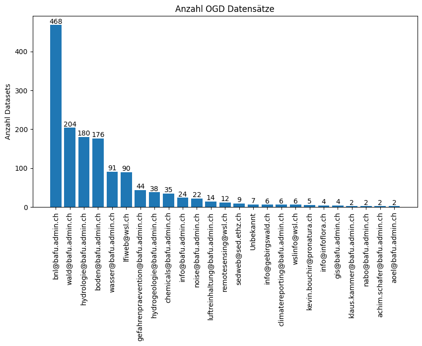
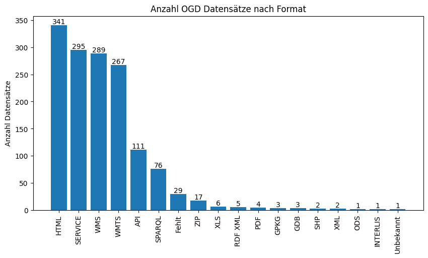

# OGD Monitoring BAFU
Auf dieser Seite werden die "Open Government Data" (OGD) Publikationen des BAFU täglich ausgewertet.
Das Monitoring basiert auf den OGD-Publikationen des BAFU auf [opendata.swiss](https://opendata.swiss/de/organization/bundesamt-fur-umwelt-bafu).

## Anzahl OGD Publikationen im BAFU

## Anzahl OGD Publikationen pro Abteilung

## Anzahl publizierter Datensätze pro Abteilung

## Anzahl publizierter Datensätze nach Datenformat

## Letze Aktualisierung der OGD Publikationen
Publikationen welche kein Aktualisierungsdatum haben werden im Jahr 1999 dargestellt.

