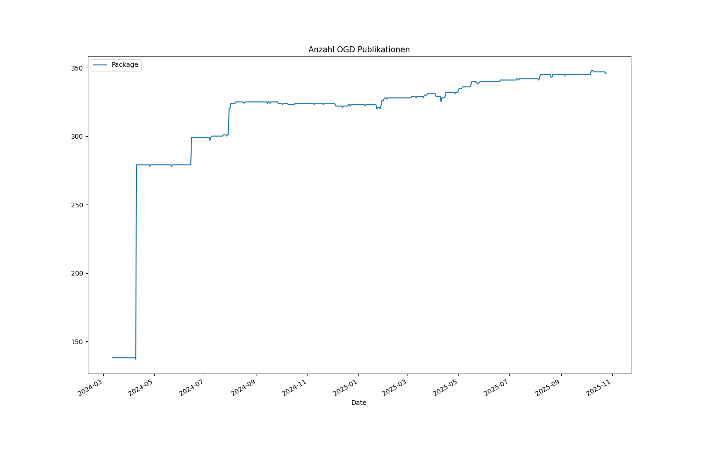
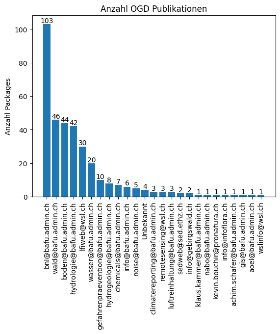
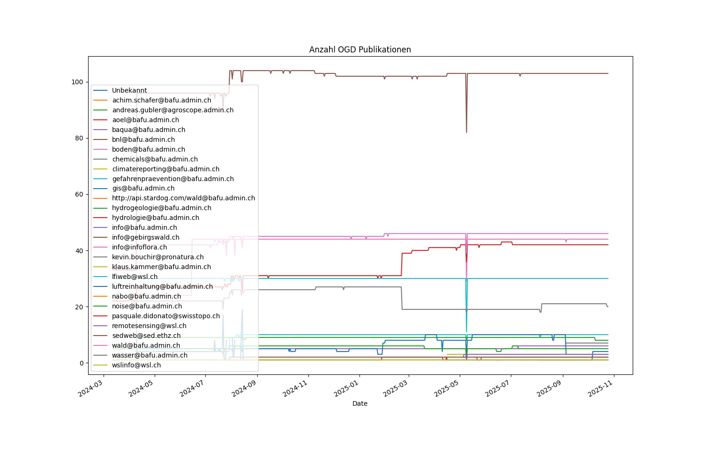
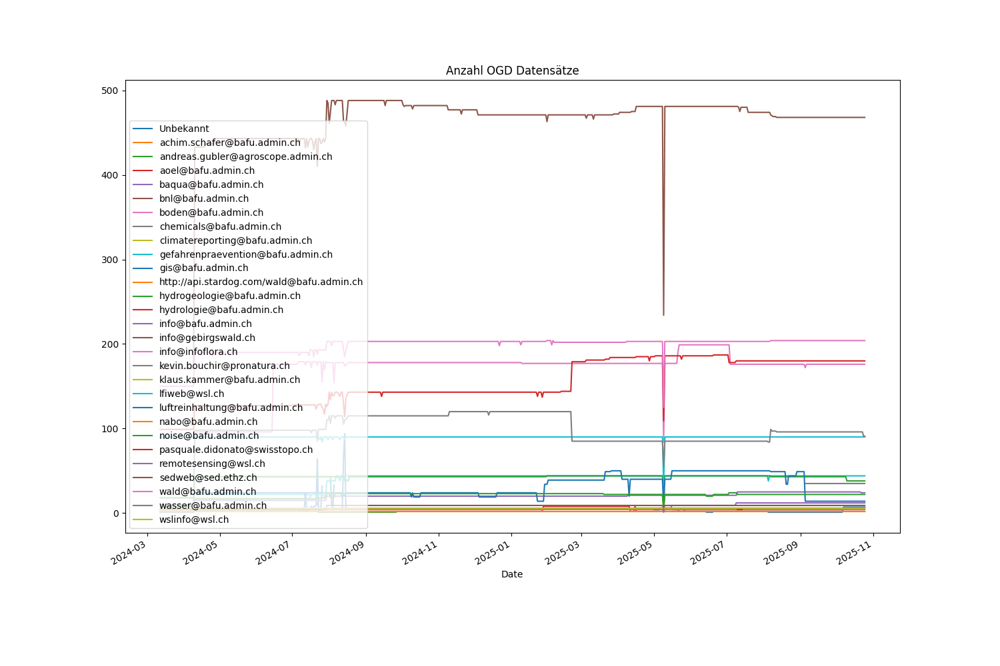
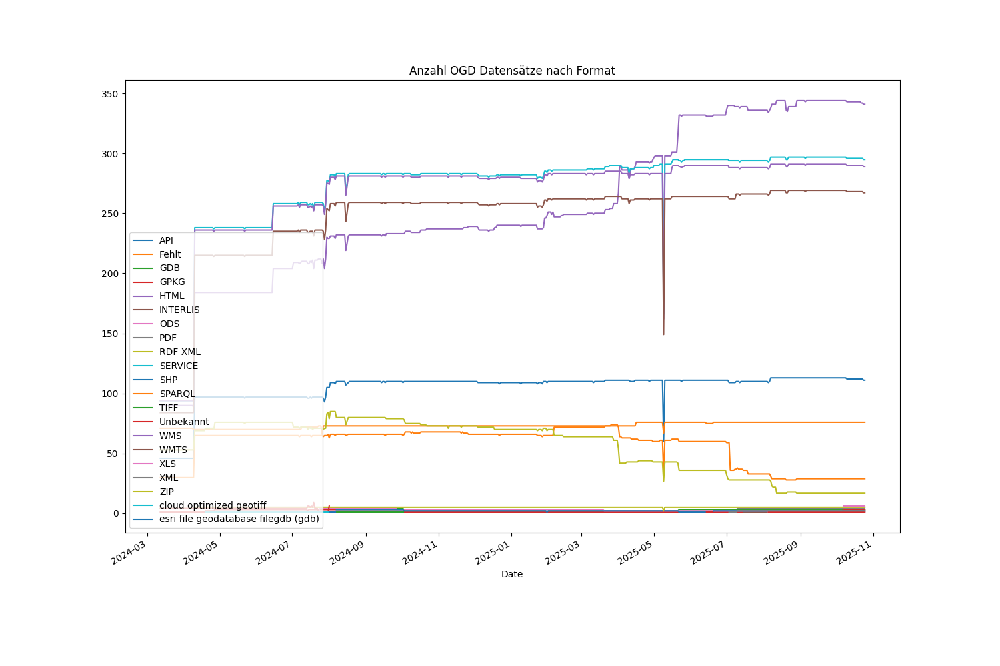
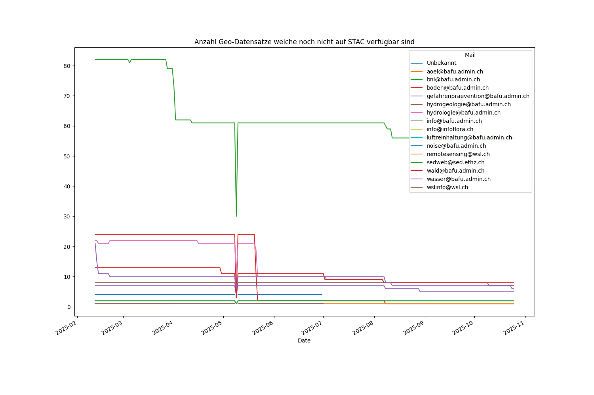
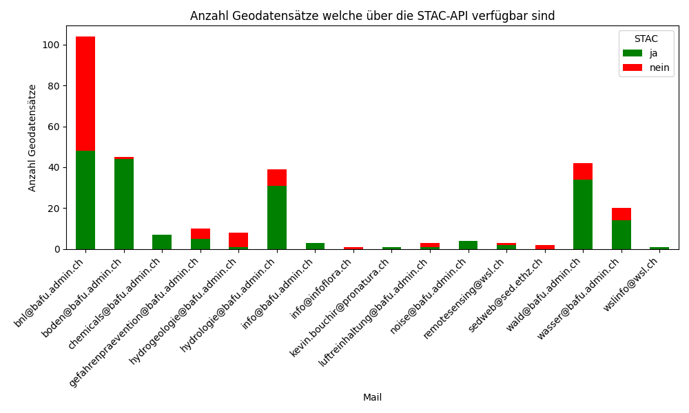
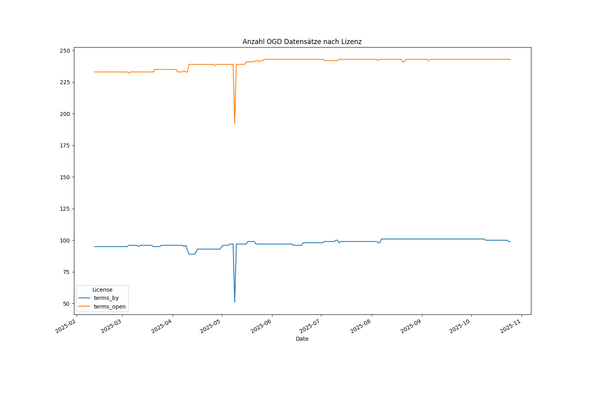
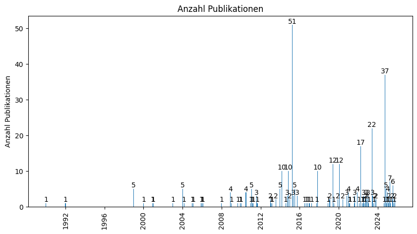
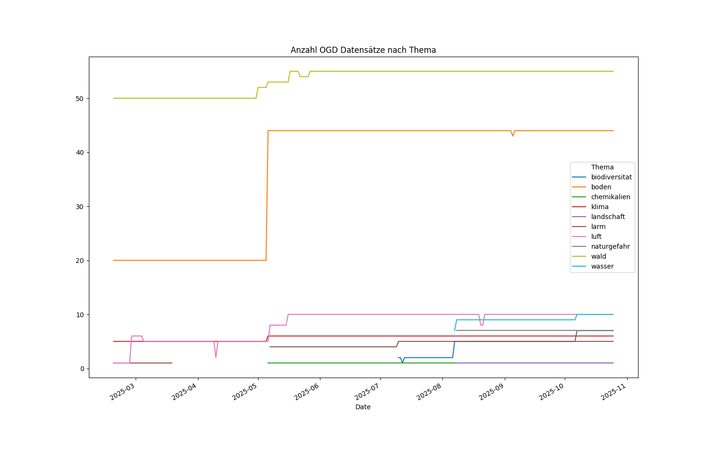

# OGD Monitoring BAFU
Auf dieser Seite werden die "Open Government Data" (OGD) Publikationen des BAFU täglich ausgewertet.
Das Monitoring basiert auf den OGD-Publikationen des BAFU auf [opendata.swiss](https://opendata.swiss/de/organization/bundesamt-fur-umwelt-bafu).

## Anzahl OGD Publikationen im BAFU

## Anzahl OGD Publikationen pro Abteilung

## Anzahl publizierter Datensätze pro Abteilung

## Anzahl publizierter Datensätze nach Datenformat

## Anzahl Geo-Datensätze welche über die STAC-API verfügbar sind

## Anzahl OGD Publikationen nach Lizenz

## Letze Aktualisierung der OGD Publikationen

## Anzahl OGD Publikationen nach Thema

**Übersicht der OGD-Daten nach Thema**
- [Daten zum Thema Abfall](https://opendata.swiss/de/dataset?keywords_de=abfall&organization=bundesamt-fur-umwelt-bafu)
- [Daten zum Thema Altlasten](https://opendata.swiss/de/dataset?keywords_de=altlasten&organization=bundesamt-fur-umwelt-bafu)
- [Daten zum Thema Bildung](https://opendata.swiss/de/dataset?keywords_de=bildung&organization=bundesamt-fur-umwelt-bafu)
- [Daten zum Thema Forschung](https://opendata.swiss/de/dataset?keywords_de=forschung&organization=bundesamt-fur-umwelt-bafu)
- [Daten zum Thema Innovation](https://opendata.swiss/de/dataset?keywords_de=innovation&organization=bundesamt-fur-umwelt-bafu)
- [Daten zum Thema Biodiversitat](https://opendata.swiss/de/dataset?keywords_de=biodiversitat&organization=bundesamt-fur-umwelt-bafu)
- [Daten zum Thema Biotechnologie](https://opendata.swiss/de/dataset?keywords_de=biotechnologie&organization=bundesamt-fur-umwelt-bafu)
- [Daten zum Thema Boden](https://opendata.swiss/de/dataset?keywords_de=boden&organization=bundesamt-fur-umwelt-bafu)
- [Daten zum Thema Chemikalien](https://opendata.swiss/de/dataset?keywords_de=chemikalien&organization=bundesamt-fur-umwelt-bafu)
- [Daten zum Thema Elektrosmog](https://opendata.swiss/de/dataset?keywords_de=elektrosmog&organization=bundesamt-fur-umwelt-bafu)
- [Daten zum Thema Licht](https://opendata.swiss/de/dataset?keywords_de=licht&organization=bundesamt-fur-umwelt-bafu)
- [Daten zum Thema Ernahrung](https://opendata.swiss/de/dataset?keywords_de=ernahrung&organization=bundesamt-fur-umwelt-bafu)
- [Daten zum Thema Wohnen](https://opendata.swiss/de/dataset?keywords_de=wohnen&organization=bundesamt-fur-umwelt-bafu)
- [Daten zum Thema Mobilitat](https://opendata.swiss/de/dataset?keywords_de=mobilitat&organization=bundesamt-fur-umwelt-bafu)
- [Daten zum Thema Gesundheit](https://opendata.swiss/de/dataset?keywords_de=gesundheit&organization=bundesamt-fur-umwelt-bafu)
- [Daten zum Thema Internationales](https://opendata.swiss/de/dataset?keywords_de=internationales&organization=bundesamt-fur-umwelt-bafu)
- [Daten zum Thema Klima](https://opendata.swiss/de/dataset?keywords_de=klima&organization=bundesamt-fur-umwelt-bafu)
- [Daten zum Thema Landschaft](https://opendata.swiss/de/dataset?keywords_de=landschaft&organization=bundesamt-fur-umwelt-bafu)
- [Daten zum Thema Larm](https://opendata.swiss/de/dataset?keywords_de=larm&organization=bundesamt-fur-umwelt-bafu)
- [Daten zum Thema Luft](https://opendata.swiss/de/dataset?keywords_de=luft&organization=bundesamt-fur-umwelt-bafu)
- [Daten zum Thema Naturgefahren](https://opendata.swiss/de/dataset?keywords_de=naturgefahren&organization=bundesamt-fur-umwelt-bafu)
- [Daten zum Thema Recht](https://opendata.swiss/de/dataset?keywords_de=recht&organization=bundesamt-fur-umwelt-bafu)
- [Daten zum Thema Storfallvorsorge](https://opendata.swiss/de/dataset?keywords_de=storfallvorsorge&organization=bundesamt-fur-umwelt-bafu)
- [Daten zum Thema Umweltvertraglichkeitsprufung](https://opendata.swiss/de/dataset?keywords_de=umweltvertraglichkeitsprufung&organization=bundesamt-fur-umwelt-bafu)
- [Daten zum Thema Wald](https://opendata.swiss/de/dataset?keywords_de=wald&organization=bundesamt-fur-umwelt-bafu)
- [Daten zum Thema Holz](https://opendata.swiss/de/dataset?keywords_de=holz&organization=bundesamt-fur-umwelt-bafu)
- [Daten zum Thema Wasser](https://opendata.swiss/de/dataset?keywords_de=wasser&organization=bundesamt-fur-umwelt-bafu)
- [Daten zum Thema Wirtschaft](https://opendata.swiss/de/dataset?keywords_de=wirtschaft&organization=bundesamt-fur-umwelt-bafu)
- [Daten zum Thema Konsum](https://opendata.swiss/de/dataset?keywords_de=konsum&organization=bundesamt-fur-umwelt-bafu)
